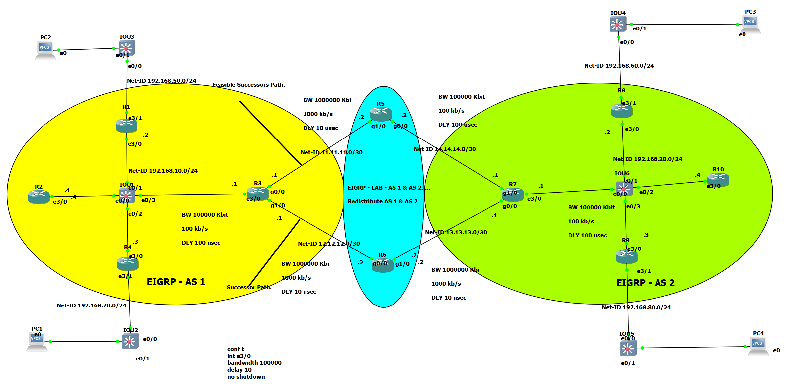
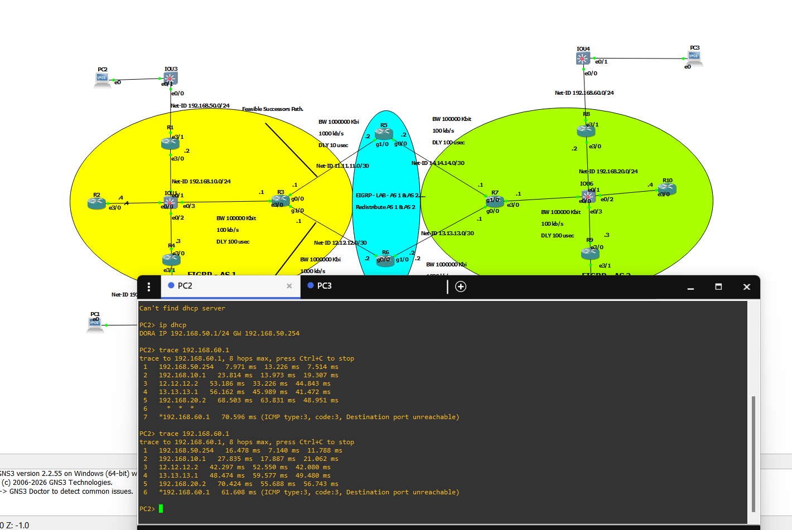
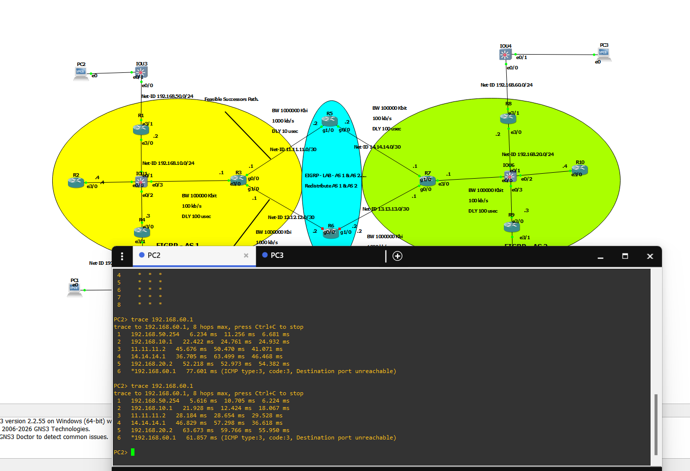

# Enterprise EIGRP Dual-AS Lab with Mutual Redistribution

## 📌 Project Overview
This project demonstrates a complex enterprise network architecture using **Cisco EIGRP**. The lab features a dual Autonomous System (AS) design, focusing on high availability, traffic engineering, and route propagation between different routing domains.

## 🛠️ Network Architecture & Features
- **Dual Autonomous Systems:** Split into `AS 1` and `AS 2` to simulate separate corporate departments or geographical locations.
- **Mutual Redistribution:** Configured on **R5** and **R6** (ASBRs) to ensure full reachability between both domains.
- **High Availability & Deterministic Traffic Steering:** - **R6 (Primary):** Configured as the **Successor Path** for inter-AS traffic.
    - **R5 (Secondary):** Configured as the **Feasible Successor Path** (Backup).
- **Traffic Engineering:** Manual manipulation of EIGRP vector metrics (`Bandwidth` and `Delay`) to achieve a predictable traffic flow.
- **Infrastructure Services:** Integrated **DHCP Pools** for end-user networks (Net50, Net60, Net70, Net80).
- **Security Best Practices:** Implementation of `passive-interface` on LAN-facing interfaces.

## 🧪 Verification & Failover Testing
The following tests demonstrate the robustness of the design and the efficiency of EIGRP in handling path redundancy.

### 1. Primary Path Analysis (R6 - Successor)
Under normal conditions, traffic from **PC2** (AS 1) to **PC3** (AS 2) follows the optimized path through **R6**.
- **Trace Path:** PC2 -> R1 -> R3 -> **R6 (12.12.12.2)** -> R7 -> R8 -> PC3.

### 2. Redundancy & Failover Test (R5 - Feasible Successor)
When the primary link (R6) is disabled, EIGRP immediately switches to the backup path through **R5** without manual intervention.
- **Failover Path:** PC2 -> R1 -> R3 -> **R5 (11.11.11.2)** -> R7 -> R8 -> PC3.

## 🚀 Key Technologies Used
- Cisco IOS (EIGRP Routing)
- Mutual Route Redistribution
- Successor & Feasible Successor Selection
- DHCP (Dynamic Host Configuration Protocol)
- Metric Manipulation (K-Values & Vector Metrics)

## 📂 Repository Structure
- **/configs:** Running configurations for all 10 routers (`R1.cfg` to `R10.cfg`).
- **topology.png:** High-resolution diagram of the network lab.
- **Screenshots:** Verification of ping and traceroute tests.

---
**Designed by: Zain Ali Al-Jarardy** *Network Engineer | IT Professional*
